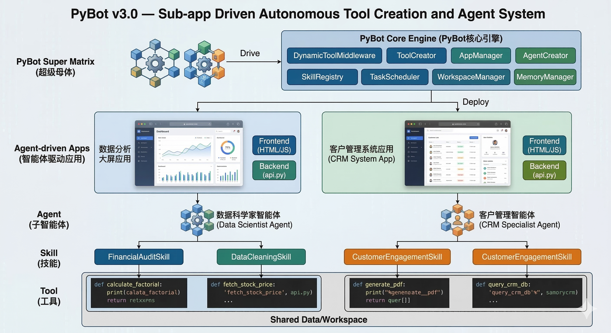
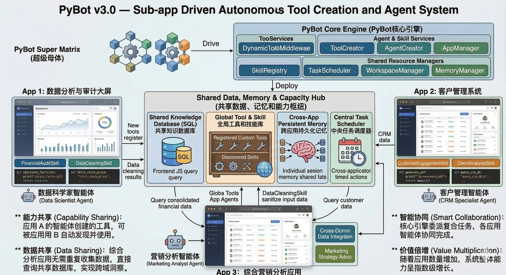

# PyBot — 持久运行的总控智能体运行时

<p align="center">
  
  
  
  
  
  
</p>

**PyBot** 同时提供三种根身份：

- **人类助手模式**：面向大多数用户的通用协作助手，负责对话、执行、分析和工具协作
- **应用矩阵模式**：面向多应用协作的中央调度智能体，负责串联 APP、工作流、子智能体和共享能力
- **全局管理员模式**：长期运行的总控智能体，负责持续接收目标、先自动拆解计划，再调度任务、创造能力并推动系统长期前进

项目的北极星仍然是把全局管理员模式做强，但这**不是**以砍掉普通聊天助手为代价。

一句话说，PyBot 想成为的是：

> **一个可治理、可恢复、可持续进化的执行中枢，而不是一堆并列的 AI 功能。**

---

## 先认清四层边界

如果这四层不分开，PyBot 很容易重新变成“功能拼盘”：

1. **根模式**：只有三种，`人类助手模式 / 应用矩阵模式 / 全局管理员模式`
2. **产品概念**：只有五种，`Tools / Skills / Agents / Workflows / Apps`
3. **横切系统**：治理、安全、记忆、RAG、MCP、可观测性、故障转移
4. **代码内部域**：`foundation / capabilities / agents / orchestration / governance / surfaces`

其中第 3 层和第 4 层都**不是**新的产品层。

PyBot 以后如果新增能力，也应该先回答一句话：它到底属于这四层里的哪一层？

## 主线定位

PyBot 对外只应该讲一条主线：

1. 它保留一个**人类助手入口**
2. 它额外提供一个**应用矩阵模式**负责应用级协作编排
3. 它再提供一个**全局管理员模式**负责长期自治与能力创造
4. 这些根模式都通过**审批、沙箱、审计、恢复机制**保持可控
5. 它把成功经验沉淀成**工具、技能、工作流、应用**

更完整的产品定位见 [docs/PRODUCT_POSITIONING.md](docs/PRODUCT_POSITIONING.md)。

## 一个中心循环

PyBot 最重要的不是“模块有多少”，而是这个循环能不能长期成立：

1. **感知与澄清**：理解需求、识别长期目标、在必要时追问
2. **拆解与调度**：决定该直接执行、创建工具、委派子智能体，还是启动工作流
3. **创造与编排**：把一次性问题变成可复用能力，而不是每次重来
4. **治理与恢复**：高风险动作进入审批，失败可重试，暂停后可恢复
5. **记忆与积累**：把工具、技能、工作流、知识和应用沉淀进系统能力池

如果一个能力不能加强这条循环，它就不该被当成 PyBot 的主产品概念。

## 模式示例

```python
from agent import create_tool_creator_agent, create_app_matrix_agent, create_ultimate_agent

# 人类助手模式
assistant = create_tool_creator_agent()

# 应用矩阵模式
app_matrix = create_app_matrix_agent()
topology_plan = app_matrix.plan_app_matrix_topology(
    goal_name="customer_ops_loop",
    goal_description="把 CRM、审计和营销应用串成一条闭环",
)

# 全局管理员模式
ultimate = create_ultimate_agent()
goal = ultimate.submit_admin_goal(
    name="grow_capabilities",
    description="持续沉淀新工具、工作流和应用能力",
)
```

## 运行时目录

PyBot 现在把**源码根**和**运行时根**分开处理：

- 源码仍然在当前仓库
- 默认运行时状态会落到仓库外
- 可以通过环境变量 `PYBOT_RUNTIME_HOME` 指定自己的运行时目录

这意味着像 `global_tools / agents_workspace / uv_envs / .tools_workspace / workspace/data`
这类真实运行产物，不必继续堆在 repo 根目录里。

## 五个产品概念

PyBot 现在依然保留五个用户可见概念，但它们不应该被理解成五个平级产品，而是总控执行体的五类“器官”：

| 概念 | 它解决什么问题 | 典型产物 |
|------|----------------|----------|
| Tools | 系统到底能执行哪些具体动作 | 动态 Python 工具、模板工具、MCP 工具 |
| Skills | 经验和流程怎样复用 | Markdown 技能包、工具绑定、提示词约定 |
| Agents | 谁来承担任务与角色 | 主智能体、子智能体、领域 worker |
| Workflows | 多步骤和多角色怎样协作 | DAG、审批节点、定时任务、辩论/共识/主管模式 |
| Apps | 最终如何面向用户交付 | Web 控制台、工作区内应用、API/CLI 入口 |

## 核心能力

下面这些能力要么属于五个产品概念之一，要么属于横切系统；它们不应再被当成新的“第六、第七平台层”。

### 1. 工具创造与执行（Tools）

PyBot 不只是调用已有工具，而是能在运行时**主动创造 Python 工具**，并在 `uv` 或其他沙箱中隔离执行。失败后还能自动诊断、改代码、重试，把临时问题转成系统长期能力。

除了运行时创造，还有：
- **模板工具**：参数化的 API 包装器、数据转换器，秒级实例化
- **MCP 桥接**：完整的 JSON-RPC 2.0 协议实现（stdio 子进程通信），自动发现社区工具
- **Docker 沙箱**：敏感操作可以在容器中隔离执行，资源限制、自动回收

### 2. 能力沉淀与共享复用（跨 Tools / Skills / Agents / Apps）

所有应用、智能体、工作流共享同一个自我增长的**能力池**：

```
分析应用创建了"数据清洗工具" → CRM 应用可以直接用
知识库摄入了行业文档 → 所有智能体都能检索
工作流定义了审批流程 → 任何应用可以触发
```

所以 PyBot 的理想形态不是“会聊天的 agent”，而是一个越运行越会组织能力的系统。

### 3. 治理与安全（横切系统）

PyBot 有完整的治理体系：

- **审批队列**：高风险操作（删除、部署、外部调用）自动暂停，等人工确认
- **风险等级**：工具按 `low/medium/high/critical` 分级，策略可配置
- **委托链可视化**：谁委托了谁，层级审批一目了然
- **审计追踪**：每一次工具调用、审批决策都有记录，支持合规审查
- **子智能体隔离**：每个子智能体有自己的工具集、权限配置和沙箱边界

### 4. 可持久运行与多模型容灾（横切系统）

一行配置切换提供商。10+ 提供商开箱即用（OpenAI、Anthropic、Google、Ollama、Groq、Mistral 等）。配置故障转移链，主模型出错（429/500/超时）自动切换备用模型，业务无感知。

除此之外，项目里已经有可持久任务执行和定时调度基础设施，目标是把它们继续收口成真正的长期运行执行体，而不是临时会话系统。

### 5. 内置知识与记忆能力（横切系统）

不需要外部向量数据库服务。文件摄入管线支持 txt/md/py/json/csv/html/pdf，自动分块、嵌入、存储。智能体通过 5 个内置工具直接搜索、摄入、管理知识库。知识在所有智能体之间共享。

### 6. 可观测性和成本控制（横切系统）
- 支持 LangSmith、Langfuse 或控制台三种 Tracing 后端
- 实时 Token 用量和 USD 成本估算（覆盖 10+ 主流模型定价）
- 调试面板实时展示所有运行时状态

---

## 横切系统

- **运行时底座**：模型解析、故障转移、观测、重试、事件、路径与会话管理
- **知识与记忆**：文档管线、向量检索、语义记忆
- **治理与安全**：审批队列、风险分级、沙箱、审计
- **集成与交付**：MCP、Channel、PyHub、Web/API/CLI

完整体系说明见 [docs/ARCHITECTURE.md](docs/ARCHITECTURE.md)。

## 架构示意

下图：核心引擎如何驱动工具创建、智能体、技能与工具，并在此基础上部署智能体驱动的应用，共享同一工作区。

<p align="center">
  
</p>

下图：核心引擎、共享数据/记忆/能力枢纽，以及多应用（如数据分析、CRM、营销）如何共享工具、技能与中央任务调度。

<p align="center">
  
</p>

## 控制台与交付面

Vue 3 构建的管理控制台：

- **仪表板** — 智能体、工具、技能、工作流、应用的状态总览
- **对话** — 多轮会话，上下文保持，工具调用过程可见
- **调试面板** — 实时成本、任务队列、MCP 连接、记忆状态、RAG 状态、提供商可用性
- **工作流编辑器** — 双栏编辑器 + 实时 DAG 可视化
- **治理中心** — 审批队列、风险等级、解决/拒绝
- **Hub** — 浏览、安装、发布包


## 引擎要点

- **中间件**：LangChain 记忆 + 事件总线，跨组件能力共享；栈可组合。
- **错误**：类型化工具错误、大输出截断、退避重试、失败自修复。
- **安全**：路径校验、ID 清洗、审批流水线、审计记录。
- **会话**：按次工作区、长对话的上下文卸载与摘要。
- **能力总线**：运行时注册的工具/技能对所有智能体可见；跨应用复用与使用统计。

---

## 为何用 PyBot

- **复用**：一个应用（如分析大屏）创建的工具，通过全局池被其他应用（如 CRM）直接使用。
- **数据共享**：应用共用同一 SQLite 数据，跨域分析无需重复采集。
- **编排**：工作流把任务拆给不同角色（辩论/共识/主管）；Channel 可将报告推到群聊。
- **沉淀**：应用和智能体越多，池中的工具、技能、工作流越丰富。

---

## 快速开始

### 安装

```bash
pip install -e .[dev]
# 或: pip install -r requirements.txt

# 可选：多 LLM 提供商
pip install -e .[all-llm]  # Anthropic + Google + Ollama + Mistral + Groq

# 可选：RAG
pip install -e .[rag]  # ChromaDB + 文本分块
```

### 配置

```bash
pybot-onboard
# 或: python onboard.py
```

### 运行

| 模式 | 命令 | URL |
|------|------|-----|
| Web 控制台 | `pybot-web` | http://localhost:5000 |
| API 服务 | `pybot-api` | http://localhost:8000 |
| 命令行 | `pybot-cli` | — |

### 开发

```bash
ruff check agent.py api_server.py interactive_cli.py onboard.py service_mode.py core web tests
ruff format agent.py api_server.py interactive_cli.py onboard.py service_mode.py core web tests
pytest
pre-commit run --all-files
```

---

## 典型场景

- **自愈工具**：工具执行报错 → 自动读取 traceback → 修复代码或依赖 → 重试成功
- **一句话建应用**：「做一个客户管理系统」→ 前端 + API + 数据模型 → 自动部署到 `/apps/crm/`
- **定时工作流**：`schedule: "0 8 * * *"` → 每天早 8 点自动执行
- **多专家决策**：辩论节点让前端专家和后端专家各抒己见，架构师裁判总结
- **知识增强**：摄入行业文档后，所有智能体的回答质量都会提升
- **故障无感**：主 LLM 限流 → 自动切换备用提供商 → 用户无感知

---

## 技术栈

| 领域 | 选型 |
|------|------|
| 编排 | LangChain 1.x + LangGraph 0.3+ |
| LLM | OpenAI, Anthropic, Google, Ollama, Groq, Mistral 等 10+ |
| 控制台 | FastAPI + Vue 3 (CDN) |
| 工作流 | PyFlow v3 (DAG + 辩论/共识/主管) |
| RAG | ChromaDB (内嵌) + 文档管线 |
| 存储 | SQLite（生产可切 PostgreSQL） |
| 工具沙箱 | `uv` venvs + Docker |
| MCP | 完整 JSON-RPC 2.0 (stdio) |
| 可观测性 | LangSmith / Langfuse / 成本追踪 |
| 测试 | pytest + Ruff |

---

## 许可证

[Apache License 2.0](LICENSE)
