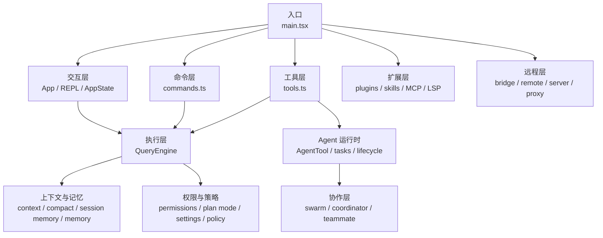

# Claude Code 源码文档解析

> 这不是官方开发仓库，而是一套围绕 `claude-code` 当前源码快照整理出来的中文研究文档。目标是让读者即使不先扎进 `src/`，也能先理解 Claude Code 这套 agent runtime 在做什么。

## 这本书在讲什么

这个仓库把 Claude Code 拆成一套可连续阅读的研究文档，重点覆盖：

- Claude Code 的启动、执行、权限、工具与状态持久化
- Anthropic 在 prompt、上下文管理、记忆、工具调用、多 agent 协作上的设计取向
- 运行协议、远程接入、灰度控制、hooks、输入系统等容易被忽略但很关键的外围机制
- 记忆、上下文与 agent 运行时里更细的算法、状态机与不变量

边界也很明确：

- 研究对象是当前仓库里可见的 `src/` 实现
- 远程服务、OAuth、真实账号与外部系统联动仍以“需真实环境验证”为准
- 文档中的设计归纳基于源码，不等于 Anthropic 官方表述

## 先看全局

Claude Code 可以粗略理解成一套面向软件工程工作流的 agentic CLI：

- [src/main.tsx](./src/main.tsx) 负责启动与总装配
- [src/commands.ts](./src/commands.ts) 和 [src/tools.ts](./src/tools.ts) 分离“用户命令”和“模型可执行动作”
- [src/QueryEngine.ts](./src/QueryEngine.ts) 把 prompt、上下文、工具调用、状态与恢复串成长期工作会话
- [src/utils/permissions/permissionSetup.ts](./src/utils/permissions/permissionSetup.ts) 和 plan mode 把安全直接嵌进 agent 工作流
- [src/tools/AgentTool/AgentTool.tsx](./src/tools/AgentTool/AgentTool.tsx)、`tasks`、`swarm`、`coordinator` 把单 agent 扩展为多角色协作系统

## 项目架构图

## 全书结构

这套文档现在按 6 个分卷组织，而不是把所有专题平铺在同一层：

- 卷一：认识 Claude Code
- 卷二：Claude Code 如何运行
- 卷三：扩展、远程与协作
- 卷四：记忆与上下文
- 卷五：Anthropic Agent 设计研究
- 卷六：操作、研究与索引

更完整的分卷目录见 [docs/README.md](./docs/README.md)。

## 推荐阅读顺序

### 新研究者

1. [01. 项目总览](./docs/01-project-overview.md)
2. [02. 目录导览与阅读顺序](./docs/02-repo-map-and-reading-order.md)
3. [03. 启动与主循环](./docs/03-startup-and-main-loop.md)
4. [07. QueryEngine 与上下文](./docs/07-query-engine-and-context.md)
5. [docs/README.md](./docs/README.md)

### 热点问题

1. prompt：[17. 系统提示词与模型决策](./docs/17-system-prompt-and-model-resolution.md)
2. 上下文：[07. QueryEngine 与上下文](./docs/07-query-engine-and-context.md)
3. 记忆：[21. 记忆系统：CLAUDE.md、Session Memory 与 Agent Memory](./docs/21-memory-and-claude-md.md)
4. 工具调用：[05. 工具系统](./docs/05-tool-system.md)
5. 多 agent：[15. Agent 设计理念研究](./docs/15-agent-philosophy-and-anthropic-design.md) 和 [20. Coordinator、Swarm 与 Teammate 协作](./docs/20-coordinator-swarm-and-teammate-collaboration.md)

### 深挖研究者

1. [19. 上下文压缩与历史治理](./docs/19-context-compression-and-history-management.md)
2. [33. Session Memory 调度与并发控制](./docs/33-session-memory-scheduling-and-concurrency.md)
3. [35. CLAUDE.md 加载算法与指令装配](./docs/35-claude-md-loading-and-instruction-assembly.md)
4. [39. Forking、子代理与上下文经济学](./docs/39-forking-subagents-and-context-economics.md)
5. [43. Agent 组织学与 Anthropic 的工作模型](./docs/43-agent-organization-theory-and-anthropic-work-model.md)

## 热点问题索引

| 研究问题 | 主入口 | 延伸入口 |
| --- | --- | --- |
| Anthropic 如何设计 prompt | [17](./docs/17-system-prompt-and-model-resolution.md) | [15](./docs/15-agent-philosophy-and-anthropic-design.md) |
| Anthropic 如何管理上下文 | [07](./docs/07-query-engine-and-context.md) | [19](./docs/19-context-compression-and-history-management.md) |
| Anthropic 如何做记忆 | [21](./docs/21-memory-and-claude-md.md) | [36](./docs/36-memory-taxonomy-and-drift-prevention.md) |
| Anthropic 如何做工具调用 | [05](./docs/05-tool-system.md) | [08](./docs/08-permissions-and-safety.md) |
| Anthropic 如何设计 agent 角色 | [15](./docs/15-agent-philosophy-and-anthropic-design.md) | [42](./docs/42-agent-definition-loading-and-availability.md) |
| fork 和 fresh subagent 有什么区别 | [39](./docs/39-forking-subagents-and-context-economics.md) | [43](./docs/43-agent-organization-theory-and-anthropic-work-model.md) |
| agent 为什么能 background / resume | [40](./docs/40-agent-runtime-lifecycle-background-and-resume.md) | [11](./docs/11-agents-and-tasks.md) |
| agent 隔离到底隔离了什么 | [41](./docs/41-agent-isolation-worktree-remote-and-cwd-overrides.md) | [28](./docs/28-direct-connect-server-and-upstream-proxy.md) |
| Claude Code 如何被外部宿主接管 | [22](./docs/22-cli-structured-io-and-transports.md) | [32](./docs/32-harness-and-eval-runtime.md) |
| 为什么源码里的功能不一定可见 | [24](./docs/24-growthbook-analytics-and-feature-control.md) | [18](./docs/18-settings-policy-and-managed-config.md) |

## 从源码入口验证

如果你已经有明确问题，最值得先点开的源码入口通常是：

- 启动与装配：[src/main.tsx](./src/main.tsx)
- 命令系统：[src/commands.ts](./src/commands.ts)
- 工具系统：[src/tools.ts](./src/tools.ts)
- 会话核心：[src/QueryEngine.ts](./src/QueryEngine.ts)
- 上下文装配：[src/context.ts](./src/context.ts)
- 权限系统：[src/utils/permissions/permissionSetup.ts](./src/utils/permissions/permissionSetup.ts)
- agent 运行时：[src/tools/AgentTool/AgentTool.tsx](./src/tools/AgentTool/AgentTool.tsx)
- agent 定义加载：[src/tools/AgentTool/loadAgentsDir.ts](./src/tools/AgentTool/loadAgentsDir.ts)
- coordinator 模式：[src/coordinator/coordinatorMode.ts](./src/coordinator/coordinatorMode.ts)

## 进入总目录

首页只负责建立整体方向。完整的分卷结构、全部章节入口和按主题组织的阅读地图在这里：

- [docs/README.md](./docs/README.md)

## 完整分卷目录

### 卷一：认识 Claude Code

- [00. 快照与边界](./docs/00-snapshot-and-scope.md)
- [01. 项目总览](./docs/01-project-overview.md)
- [02. 目录导览与阅读顺序](./docs/02-repo-map-and-reading-order.md)

### 卷二：Claude Code 如何运行

- [03. 启动与主循环](./docs/03-startup-and-main-loop.md)
- [04. 命令系统](./docs/04-command-system.md)
- [05. 工具系统](./docs/05-tool-system.md)
- [06. UI、状态与 REPL](./docs/06-ui-state-and-repl.md)
- [07. QueryEngine 与上下文](./docs/07-query-engine-and-context.md)
- [08. 权限与安全控制](./docs/08-permissions-and-safety.md)
- [16. 会话持久化与恢复机制](./docs/16-session-persistence-and-recovery.md)
- [17. 系统提示词与模型决策](./docs/17-system-prompt-and-model-resolution.md)
- [18. Settings、Policy 与托管配置](./docs/18-settings-policy-and-managed-config.md)
- [19. 上下文压缩与历史治理](./docs/19-context-compression-and-history-management.md)

### 卷三：扩展、远程与协作

- [09. 扩展体系：Plugins、Skills、MCP、LSP](./docs/09-extensions-plugins-skills-mcp-lsp.md)
- [10. Bridge、Remote 与 IDE 集成](./docs/10-bridge-remote-and-ide.md)
- [11. 子代理与任务系统](./docs/11-agents-and-tasks.md)
- [20. Coordinator、Swarm 与 Teammate 协作](./docs/20-coordinator-swarm-and-teammate-collaboration.md)
- [22. CLI Structured IO、Control Protocol 与 Transports](./docs/22-cli-structured-io-and-transports.md)
- [23. API Client、鉴权与 Provider 路由](./docs/23-api-client-auth-and-provider-routing.md)
- [24. GrowthBook、Analytics 与 Feature Control](./docs/24-growthbook-analytics-and-feature-control.md)
- [25. Hooks 与 Runtime Extensibility](./docs/25-hooks-and-runtime-extensibility.md)
- [26. Keybindings 与 Vim 输入状态机](./docs/26-keybindings-and-vim-input-state-machine.md)
- [27. Output Styles 与 Response Shaping](./docs/27-output-styles-and-response-shaping.md)
- [28. Direct Connect、Server 与 Upstream Proxy](./docs/28-direct-connect-server-and-upstream-proxy.md)
- [30. Assistant、Voice 与 Runtime Modes](./docs/30-assistant-voice-and-runtime-modes.md)
- [31. Buddy、Git 状态与 Workflow Observability](./docs/31-buddy-git-and-workflow-observability.md)
- [32. Harness 与 Eval Runtime](./docs/32-harness-and-eval-runtime.md)

### 卷四：记忆与上下文

- [21. 记忆系统：CLAUDE.md、Session Memory 与 Agent Memory](./docs/21-memory-and-claude-md.md)
- [29. Team Memory Sync 与 Shared Repo Memory](./docs/29-team-memory-sync-and-shared-repo-memory.md)
- [33. Session Memory 调度与并发控制](./docs/33-session-memory-scheduling-and-concurrency.md)
- [34. History Snip、Replay 与 Projected View](./docs/34-history-snip-and-replay-projection.md)
- [35. CLAUDE.md 加载算法与指令装配](./docs/35-claude-md-loading-and-instruction-assembly.md)
- [36. Memory Taxonomy 与 Drift 防护](./docs/36-memory-taxonomy-and-drift-prevention.md)
- [37. Agent Memory Snapshot 与 Sync Protocol](./docs/37-agent-memory-snapshot-and-sync-protocol.md)
- [38. ReadFileState、Context Cache 与 Partial View 机制](./docs/38-read-file-state-and-context-cache-mechanics.md)

### 卷五：Anthropic Agent 设计研究

- [15. Agent 设计理念研究](./docs/15-agent-philosophy-and-anthropic-design.md)
- [39. Forking、子代理与上下文经济学](./docs/39-forking-subagents-and-context-economics.md)
- [40. Agent 运行时生命周期：Background 与 Resume](./docs/40-agent-runtime-lifecycle-background-and-resume.md)
- [41. Agent 隔离：Worktree、Remote 与 CWD Override](./docs/41-agent-isolation-worktree-remote-and-cwd-overrides.md)
- [42. Agent Definition 加载与可用性](./docs/42-agent-definition-loading-and-availability.md)
- [43. Agent 组织学与 Anthropic 的工作模型](./docs/43-agent-organization-theory-and-anthropic-work-model.md)

### 卷六：操作、研究与索引

- [12. CLI 操作手册](./docs/12-cli-operations.md)
- [13. 源码研究操作手册](./docs/13-source-research-playbook.md)
- [14. 术语表](./docs/14-glossary.md)
